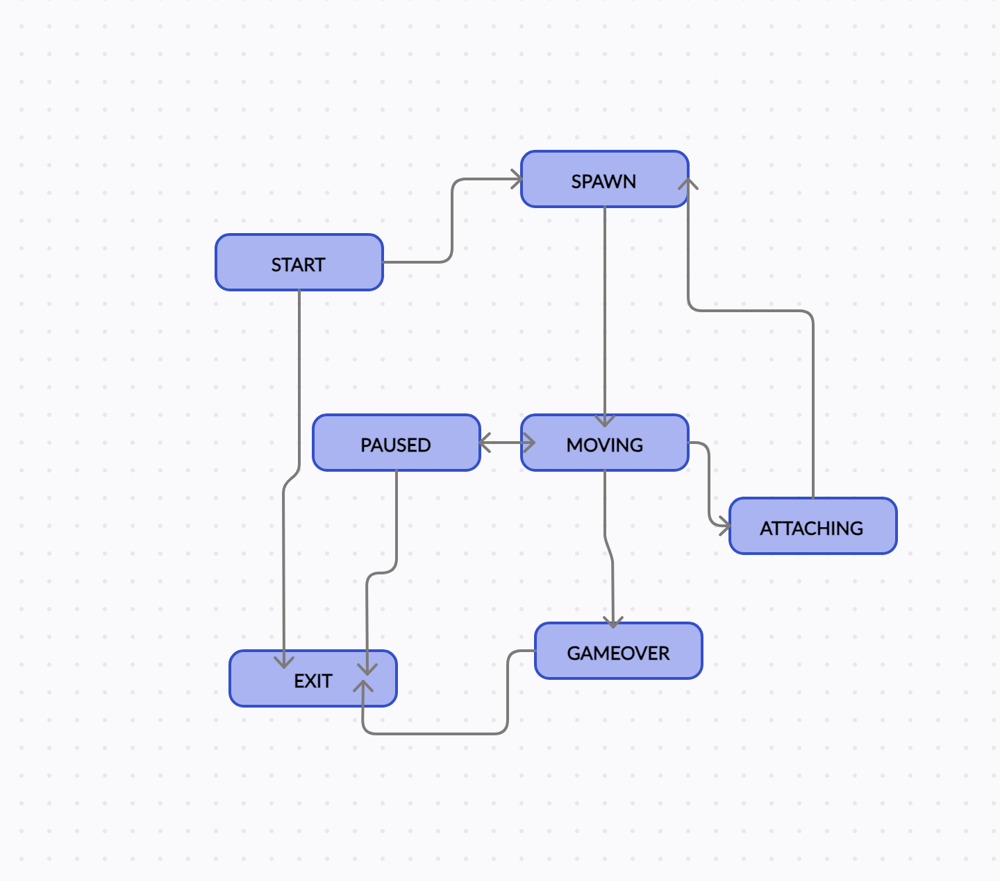
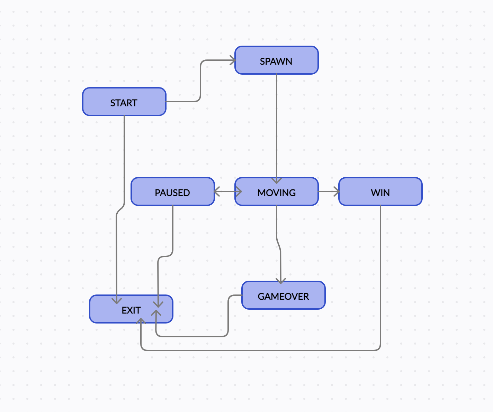

# BrickGame V. 1.0: Tetris. Краткое руководство пользователя

## Как играть ?

### Управление

Для управления процессом игры Вы можете использовать следующие клавиши:

- ***s*** - начало игры, инициализация игрового и информационного полей;
- ***Стрелка влево*** - движение фигуры по горизонтали влево;
- ***Стрелка вправо*** - движение фигуры по горизонтали вправо;
- ***Стрелка вниз*** - движение фигуры по вертикали до конца игрового поля;
- ***Пробел*** - поворот фигуры на 90 градусов;
- ***p*** - постановка игры на паузу/возобновление игры после паузы;
- ***q*** - выход из игры.

В данной игре присутствует информационное поле, которое находится *справа* от игрового. На нем можно отслеживать следующую информацию:

- текущее количество очков;
- текущий рекорд;
- уровень;
- скорость;
- тип следующей фигуры.

За уничтожение линий игрок получает количество очков, соответствующее количеству уничтоженных линий:

- **1 линия** - +100 очков;
- **2 линии** - +300 очков;
- **3 линии** - +700 очков;
- **4 линии** - +1500 очков;

В игре есть ***10 уровней***. Каждый уровень прямо влияет на ускорение падения фигуры. Уровень повышается каждые **600 очков**. **Максимальное количество уровней - 10**.

При достижении фигурой верхнего края игрового поля **игра завершается**.

## Логическая организация игры

Логическая составляющая игры формализована в виде такой математической абстракции, как **конечный автомат**. Идея заключается в том, что программа находится лишь в одном состоянии в каждый момент времени. Состояние меняется в зависимости от ввода пользователя и от хода самой игры. 

### Схема реализации конечного автомата в данной игре:

Согласно данной схеме, игра может находиться в следующих состояниях:

- **GAME_START**. Состояние, в котором происходит инициализация игры, включая создание игрового поля, генерацию первой фигуры и установку начальных значений для счета, уровня и скорости.
- **GAME_SPAWN**. Состояние, в котором генерируется новая фигура и помещается на игровое поле.
- **GAME_MOVING**. Состояние, в котором фигура движется по игровому полю в соответствии с нажатыми клавишами и правилами игры. 
- **GAME_ATTACHING**. Состояние, в котором проверяется, не столкнулась ли фигура с другими фигурами или границами игрового поля, и, если да, то фигура фиксируется на игровом поле, а также проверяется, не было ли уничтожено полных линий.
- **GAME_OVER**. Состояние, в котором игрок видит сообщение об окончании игры и может нажать кнопку "q", чтобы выйти из игры.
- **GAME_PAUSED**. Постановка игры на паузу, предыдущее состояние сохраняется. При повторном нажатии возобновление игрового процесса. 
- **GAME_EXIT**. Выход из игры. Программа переходит в данное состояние при решении пользователя завершить игровой процесс. 

# BrickGame V. 2.0: Snake. Краткое руководство пользователя

### Управление

Для управления процессом игры Вы можете использовать следующие клавиши:

- ***s*** - начало игры, инициализация игрового и информационного полей;
- ***p*** - постановка игры на паузу/возобновление игры после паузы;
- ***q*** - выход из игры.

Пользователь может менять направление движение змейки с помощью **стрелок**.

В данной игре присутствует информационное поле, которое находится *справа* от игрового. На нем можно отслеживать следующую информацию:

- текущее количество очков;
- текущий рекорд;
- уровень;
- скорость.

Когда змейка сталкивается с «яблоком», ее длина увеличивается на один.

В игре есть ***10 уровней***. Каждый раз, когда игрок набирает 5 очков, уровень увеличивается на 1. Повышение уровня увеличивает скорость движения змейки. Максимальное количество уровней — 10.

Если змейка сталкивается с границей поля или сама с собой, **игра заканчивается поражением игрока**.
Если длина змейки достигает 200 единиц, игра заканчивается **победой игрока**.

## Логическая организация игры

Логическая составляющая игры формализована в виде такой математической абстракции, как **конечный автомат**. Идея заключается в том, что программа находится лишь в одном состоянии в каждый момент времени. Состояние меняется в зависимости от ввода пользователя и от хода самой игры. 

### Схема реализации конечного автомата в данной игре:

Согласно данной схеме, игра может находиться в следующих состояниях:

- **GAME_PRESTART**. Начальное состояние, в котором игрок видит стартовый экран и может нажать кнопку "s", чтобы начать игру.
- **GAME_START**. Состояние, в котором происходит инициализация игры, включая создание игрового поля, генерацию змейки, яблока и установку начальных значений для счета, уровня и скорости.
- **GAME_SPAWN**. Состояние, в котором генерируется яблоко и помещается на игровое поле.
- **GAME_MOVING**. Состояние, в котором змейка движется по игровому полю в соответствии с нажатыми клавишами и правилами игры. 
- **GAME_WON**. Состояние, в котором проверяется, достигает ли длина змейки  200 единиц, что означает победу игрока.
- **GAME_OVER**. Состояние, в котором игрок видит сообщение об окончании игры и может нажать кнопку "q", чтобы выйти из игры.
- **GAME_PAUSED**. Постановка игры на паузу, предыдущее состояние сохраняется. При повторном нажатии возобновление игрового процесса. 
- **GAME_EXIT**. Выход из игры. Программа переходит в данное состояние при решении пользователя завершить игровой процесс. 

## Сборка, установка необходимых файлов

### MAKEFILE:

- *all*
 Является целью по умолчанию.

- *install_cli*
  Собирает консольную версию игры в текущей директории.

- *run_cli*
  Запускает CLI версию игры.

- *install_desktop*
  Устанавливает Desktop версию игры, создавая необходимые файлы и директории.

- *run_desktop*
  Запускает Desktop версию игры.

- *uninstall*
  Удаляет исполняемый файл игры, а также все необходимые для игры файлы.

- *dvi*
  Открывает Doxyfile.

- *dist*
  Создает архивную директорию с необходимыми для игры файлами.

- *test_tetris*
  Запускает тестирование логической составляющей игры Тетрис.

- *test_snake*
  Запускает тестирование логической составляющей игры Змейка.

- *gcov_report_tetris*
  Запускает тестирование логической составляющей игры Тетрис и создает отчет о доле покрытия тестами исходного кода программы.

- *gcov_report_snake*
  Запускает тестирование логической составляющей игры Змейка и создает отчет о доле покрытия тестами исходного кода программы.

- *style_check*
  Проверяет исходные и заголовочные файлы на соответствие стилю Google.

- *style*
  Применяет стиль Google к исходным и заголовочным файлам.

- *clean*
  Очищает рабочую директорию от файлов отчета покрытия тестами, объектных и исполняемых файлов.